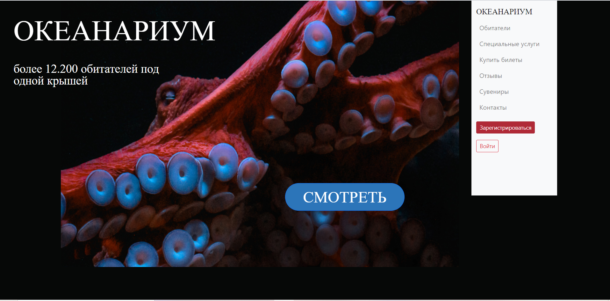
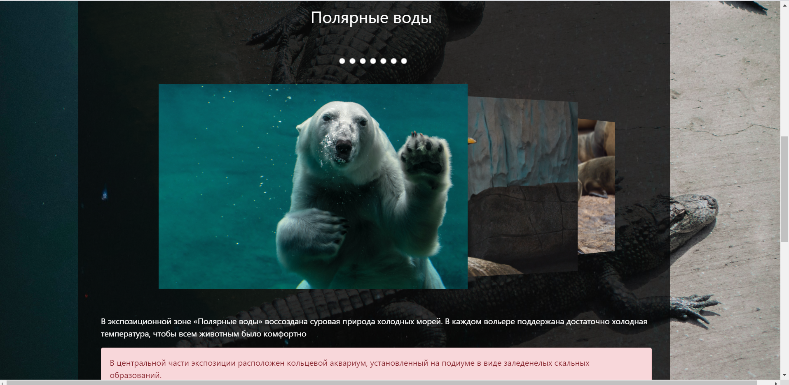
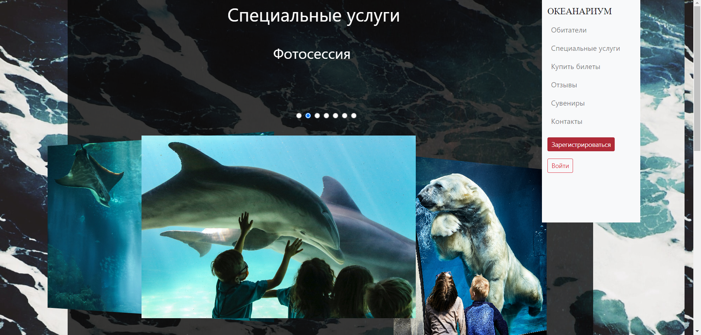
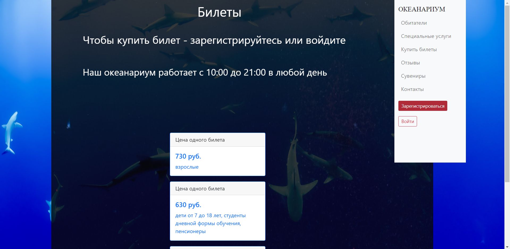
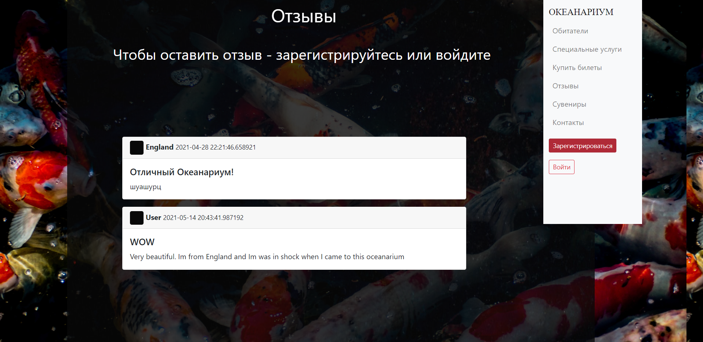
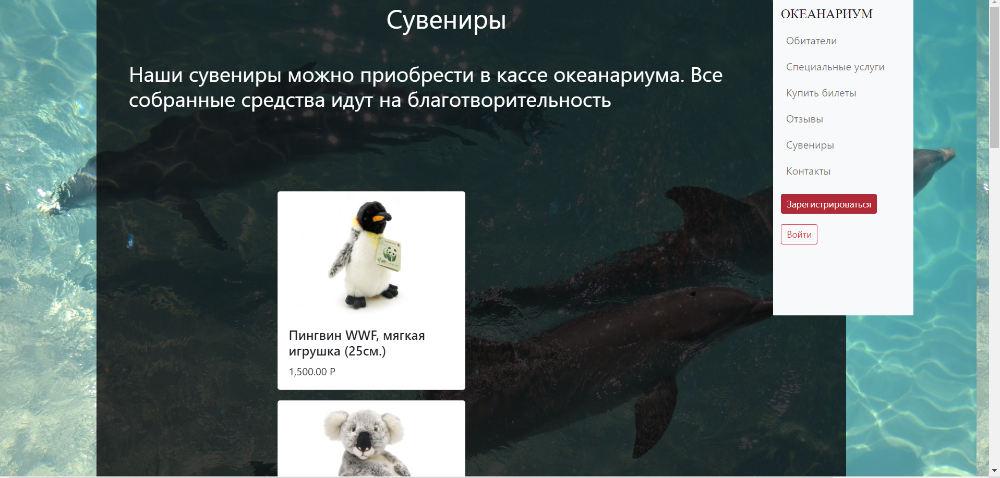
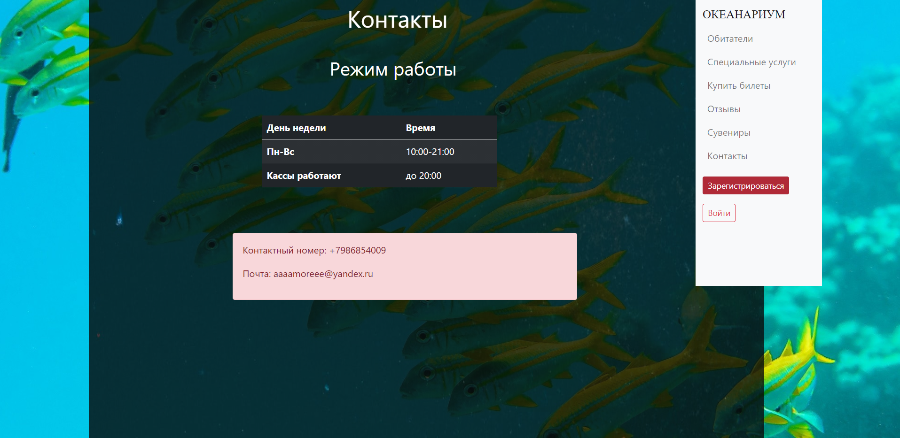
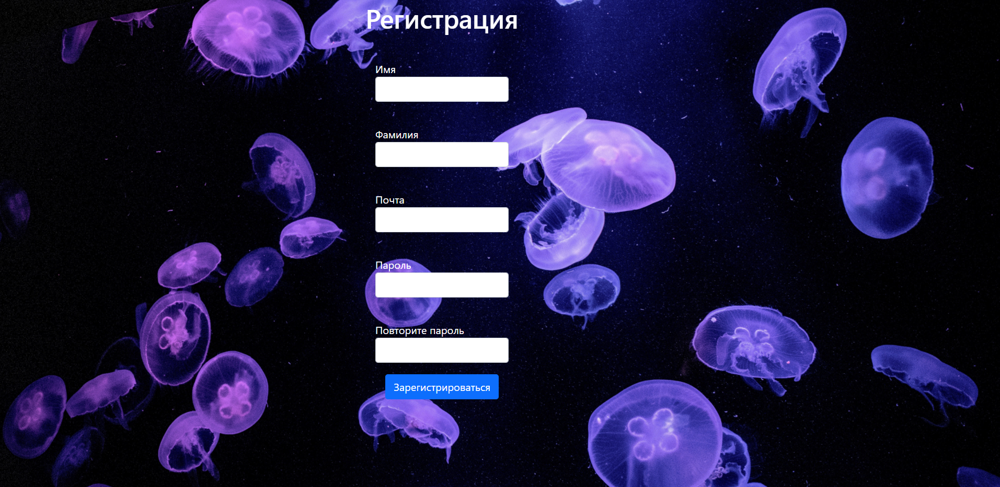

<h1 align="center">ОКЕАНАРИУМ</h1>

<h2>Сайт океанариума с красочным дизайном и невероятными
животными</h2>
<h3>Техническое задание:</h3>

1) Возможность авторизации и регистрации

2) использование flask и sqlalchemy, bootstrap

3) зарегистрированные пользователи могут оставлять отзывы и покупать билеты

4) таблицы пользователей, товаров, билетов, отзывов

5) возможность посмотреть обитателей, специальные предложения, контакты

6) раскрытие сайта на heroku

<h3>Установка</h3>

Необходимо скачать сторонние библиотеки из файла requirements.txt и шрифт "SovMod.ttf", находящийся в папке 
static/img

<h3>Информация о работе</h3>
<h4>Перед просмотром запустите, пожалуйста, файл main.py и прейдите 
по ссылке "http://192.168.1.119:5000/" или "https://oceanarium-d.herokuapp.com/", тк 
мой проект открыт также на heroku</h4>
<h5>Главная страница ("/", enter.html)</h5>

Нажав на кнопку "смотреть" пользователь переходит на страницу с обитателями

Из меню можно перейти на все страницы и вернуться обратно на главную, 
нажав на "ОКЕАНАРИУМ"

<h5>Обитатели ("/inhabitants", inhabitants.html)</h5>

Существует 3 экспозиции океанариума, практически все животные
представлены на странице, их можно просмотреть, нажав на radiobutton сверху

К каждой экспозиции добавлено небольшое описание

Переход между картинками ипользует radiobutton и создает карусель

<h5>Специальные предложения ("/services", services.html)</h5>

Также, как и с обитателями, фотографии услуг можно посмотреть нажатием на radiobutton

Внизу каждого предложения написано, где можно купить данную услугу

<h5>Покупка билетов ("/tickets", "/buy_tickets", "/buy/", buy.html, buy_tickets.html, tickets.html)</h5>

Каждый зарегистрированный пользователь может покупать билеты, 
после нажатия кнопки "купить билет", пользователь попадает на форму покупки, там он может выбрать день и
количество билетов. Потом он переходит на окно оплаты картой (макет)

Если пользователь не зарегистрирован, то он может посмотреть цены на билеты, и ему высветится
надпись о том, что чтобы купить билет, нужно зарегистрироваться.

Все работает с помощью wtf.forms

<h5>Отзывы ("/reviews", '/add_reviews', '/reviews_delete/", reviews.html, add_reviews.html)</h5>

Зарегистрированный пользователь также может оставлять отзывы, удалять и изменять ихф

На каждом отзыве пишется имя пользователя, дата и время написания

Все работает с помощью wtf.forms

<h5>Сувениры ("/souvenirs", souvenirs.html)</h5>

Загрузка картинок происходить из базы данных

<h5>Контакты ("/contacts", contacts.html)</h5>

Таблица с режимом работы и контакты, соответственно

<h5>Регистрация ("/register", register.html)</h5>

Происходит с помощью форм, сразу же после нужно войти

<h5>Вход ('/login', login.html)</h5>

Есть проверка на наличие пользователя, проект с помощью sqlalchemy 
поключен к базе данных oceanarium.db

Выйти можно, нажав на кновку с именем пользователя

<h5>Тесты</h5>

Есть тесты для пользователей (data/test_user.py) и отзывов (data/test_reviews.py)

